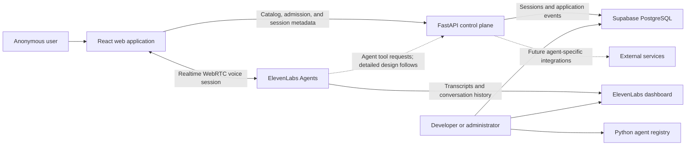
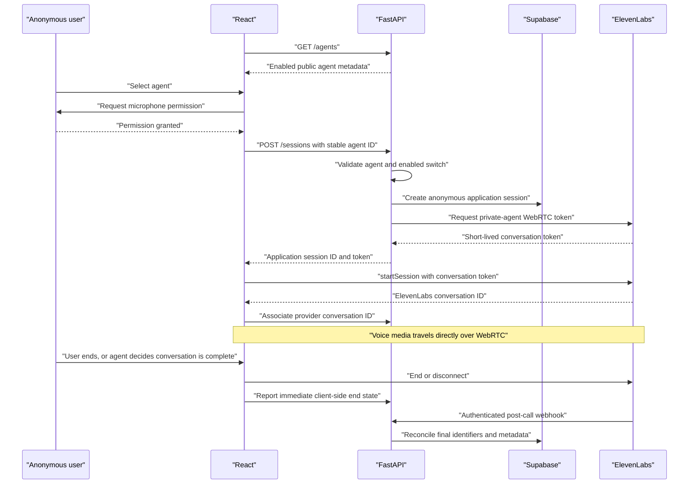

# V1 Platform Architecture and Session Lifecycle

- Status: Approved checkpoint
- Date: 2026-08-12

This document covers the platform foundation agreed so far. It does not define
the internal behavior or tool set of either v1 agent.

## System boundary



## Component responsibilities

### React web application

- Fetch public catalog metadata from `GET /agents`.
- Present enabled agents to the user.
- Request microphone permission.
- Ask FastAPI to authorize and prepare a session.
- Start the ElevenLabs React SDK session using a short-lived conversation
  token.
- Maintain the user-visible call state and controls.
- Associate the ElevenLabs conversation ID returned by `startSession()` with
  the application session.
- Report immediate client-side disconnection state.

### FastAPI control plane

- Own the code-defined flat agent registry.
- Expose public catalog metadata without provider credentials or internal
  routing details.
- Resolve stable application agent IDs to private ElevenLabs agent IDs.
- Enforce the enabled switch before every new session.
- Create anonymous application sessions.
- Use the server-side ElevenLabs API key to request short-lived WebRTC
  conversation tokens.
- Persist application session metadata and business events through Supabase.
- Receive and authenticate post-call ElevenLabs webhooks.
- Reconcile final provider metadata without persisting transcripts or audio.
- Provide the future boundary for agent-specific tools and integrations.

FastAPI is not in the realtime media path.

### ElevenLabs Agents

- Run the two private voice agents.
- Establish the browser WebRTC session from a server-issued token.
- Provide speech recognition, LLM orchestration, speech synthesis, turn-taking,
  interruption handling, and conversation termination.
- Return a globally unique ElevenLabs conversation ID to the React SDK.
- Retain provider-side transcripts and conversation history for developer
  inspection.
- Send configured post-call lifecycle information to FastAPI.

### Supabase PostgreSQL

- Store anonymous application sessions.
- Store the mapping between stable application agent IDs and individual
  sessions.
- Store the ElevenLabs conversation ID once known.
- Store lifecycle timestamps, statuses, and application-owned events.
- Exclude transcripts and audio from the v1 data model.

### Administrative surfaces

V1 does not have a custom administrator application. Developers use:

- the Python service to modify catalog metadata and enabled switches;
- the ElevenLabs dashboard for agent configuration, transcripts, and provider
  history;
- the Supabase dashboard for application sessions and business events.

## Agent catalog

The catalog is a flat, code-defined registry in the Python service. Each public
entry includes only presentation and selection metadata, for example:

```json
{
  "id": "drive-thru",
  "name": "Drive-Through",
  "description": "Place a drive-through order using voice.",
  "image": "/agents/drive-thru.webp",
  "enabled": true
}
```

Internal registry data also maps the stable `id` to its private ElevenLabs
agent ID. Internal provider identifiers and credentials are not returned by
`GET /agents`.

`GET /agents` returns enabled agents only. FastAPI repeats the enabled check
when a session is requested, so a stale browser catalog cannot bypass the
control switch.

Using Supabase as a dynamic agent catalog and building an admin management UI
are deferred. FastAPI remains the catalog API boundary, so the storage
implementation can change later without changing React.

## Session initialization boundary

`POST /sessions` is the conceptual endpoint for authorizing and preparing a
call. It does not create the realtime media connection.

Its agreed responsibilities are:

1. Accept the stable public application agent ID.
2. Validate that the agent exists and is enabled.
3. Create an anonymous application session in Supabase.
4. Resolve the private ElevenLabs agent ID internally.
5. Request a short-lived WebRTC conversation token from ElevenLabs.
6. Return the application session ID and conversation token to React.

The exact request and response schema will be finalized when the React SDK and
backend integration are implemented. This is an intentionally deferred API
detail, not an undecided system responsibility.

## Session lifecycle



## Access-control behavior

- Both deployed v1 ElevenLabs agents are private.
- The ElevenLabs API key exists only in FastAPI's server environment.
- Anonymous access does not bypass FastAPI; every new call needs a token issued
  through the control plane.
- Disabling an agent removes it from `GET /agents` and causes new session
  requests for it to be rejected.
- Disabling an agent does not terminate an already connected conversation.
- Rate limiting, CAPTCHA, and more advanced abuse controls can be added at the
  FastAPI boundary later without changing the media architecture.

## Data flow after disconnection

The React SDK supplies immediate user-interface state through its disconnect
callback. That signal is useful but is not sufficient as the only durable
lifecycle source because a browser can close or lose connectivity.

ElevenLabs post-call webhooks provide a later reconciliation path. The payload
can contain the provider conversation ID, application correlation metadata,
status, duration, termination metadata, transcript, tool activity, and analysis.
FastAPI stores only the identifiers and application-required metadata. It does
not store the transcript or audio in v1.

## Deferred follow-on design

The next design phase will specify, independently for each agent:

- prompt, voice, knowledge, and conversation goals;
- tools and whether they retrieve information or perform actions;
- tool execution boundaries and schemas;
- structured outcomes and business events;
- completion, failure, and escalation behavior;
- behavioral tests and evaluation criteria.

The platform error-state model, webhook verification details, Supabase schema,
deployment topology, and automated test plan will be finalized before an
implementation plan is written.

## References

- https://elevenlabs.io/docs/eleven-agents/libraries/react
- https://elevenlabs.io/docs/eleven-agents/libraries/java-script
- https://elevenlabs.io/docs/eleven-agents/workflows/post-call-webhooks
