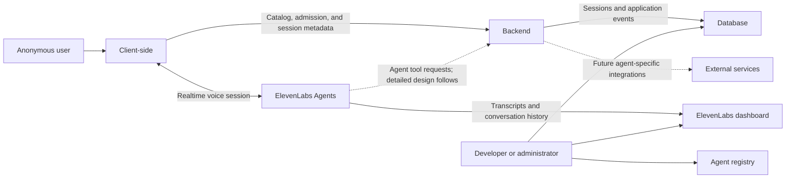
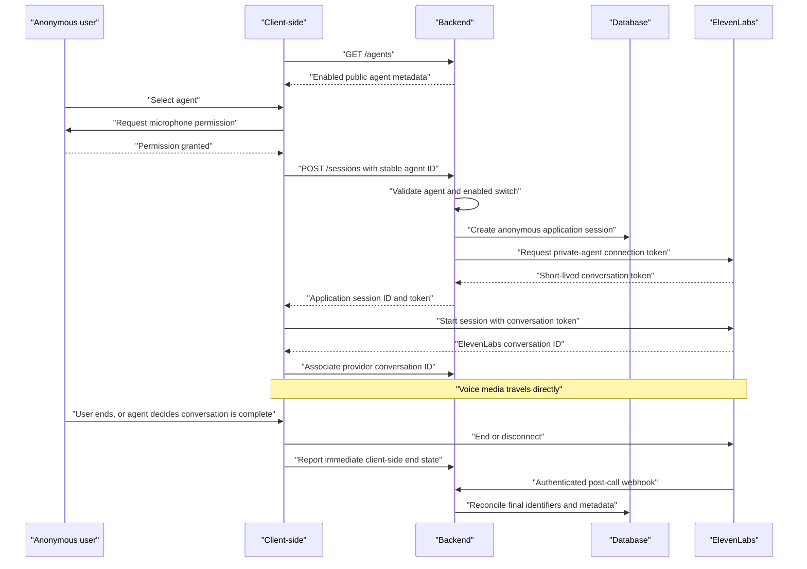

# Platform Architecture and Session Lifecycle

- Status: Approved checkpoint
- Date: 2026-08-12
- Scope: Version 1

This document covers the platform foundation agreed so far. It does not define
the internal behavior or tool set of either agent. All sections below apply to
the stated scope unless explicitly noted otherwise.

## System boundary



## Component responsibilities

### Client-side

- Fetch public catalog metadata from `GET /agents`.
- Present enabled agents to the user.
- Request microphone permission.
- Ask Backend to authorize and prepare a session.
- Start an ElevenLabs session using a short-lived conversation token.
- Maintain the user-visible call state and controls.
- Associate the ElevenLabs conversation ID returned when the session starts
  with the application session.
- Report immediate client-side disconnection state.

### Backend

- Own the code-defined flat agent registry.
- Expose public catalog metadata without provider credentials or internal
  routing details.
- Resolve stable application agent IDs to private ElevenLabs agent IDs.
- Enforce the enabled switch before every new session.
- Create anonymous application sessions.
- Use the server-side ElevenLabs API key to request short-lived WebRTC
  conversation tokens.
- Persist application session metadata and business events in Database.
- Receive and authenticate post-call ElevenLabs webhooks.
- Reconcile final provider metadata without persisting transcripts or audio.
- Provide the future boundary for agent-specific tools and integrations.

Backend is not in the realtime media path.

### ElevenLabs Agents

- Run the two private voice agents.
- Establish the browser WebRTC session from a server-issued token.
- Provide speech recognition, LLM orchestration, speech synthesis, turn-taking,
  interruption handling, and conversation termination.
- Return a globally unique ElevenLabs conversation ID to Client-side.
- Retain provider-side transcripts and conversation history for developer
  inspection.
- Send configured post-call lifecycle information to Backend.

### Database

- Store anonymous application sessions.
- Store the mapping between stable application agent IDs and individual
  sessions.
- Store the ElevenLabs conversation ID once known.
- Store lifecycle timestamps, statuses, and application-owned events.
- Exclude transcripts and audio from the data model.

### Administrative surfaces

The platform does not have a custom administrator application. Developers use:

- Backend configuration to modify catalog metadata and enabled switches;
- the ElevenLabs dashboard for agent configuration, transcripts, and provider
  history;
- the database administration surface for application sessions and business
  events.

## Agent catalog

The catalog is a flat, code-defined registry owned by Backend. Each public
entry includes only presentation and selection metadata, for example:

```json
{
  "id": "drive-thru",
  "name": "Drive-Through",
  "description": "Place a drive-through order using voice.",
  "image": "/agents/drive-thru.webp",
  "enabled": true
}
```

Internal registry data also maps the stable `id` to its private ElevenLabs
agent ID. Internal provider identifiers and credentials are not returned by
`GET /agents`.

`GET /agents` returns enabled agents only. Backend repeats the enabled check
when a session is requested, so a stale Client-side catalog cannot bypass the
control switch.

Using Database as a dynamic agent catalog and building an admin management UI
are deferred. Backend remains the catalog API boundary, so the storage
implementation can change later without changing Client-side.

## Session initialization boundary

`POST /sessions` is the conceptual endpoint for authorizing and preparing a
call. It does not create the realtime media connection.

Its agreed responsibilities are:

1. Accept the stable public application agent ID.
2. Validate that the agent exists and is enabled.
3. Create an anonymous application session in Database.
4. Resolve the private ElevenLabs agent ID internally.
5. Request a short-lived WebRTC conversation token from ElevenLabs.
6. Return the application session ID and conversation token to Client-side.

The exact request and response schema will be finalized when the Client-side,
Backend, and ElevenLabs integration are implemented. This is an intentionally
deferred API detail, not an undecided system responsibility.

## Session lifecycle



## Access-control behavior

- Both deployed ElevenLabs agents are private.
- The ElevenLabs API key exists only in the Backend environment.
- Anonymous access does not bypass Backend; every new call needs a
  token issued through it.
- Disabling an agent removes it from `GET /agents` and causes new session
  requests for it to be rejected.
- Disabling an agent does not terminate an already connected conversation.
- Rate limiting, CAPTCHA, and more advanced abuse controls can be added at the
  Backend boundary later without changing the media architecture.

## Data flow after disconnection

Client-side receives immediate disconnection state from the ElevenLabs client
integration. That signal is useful but is not sufficient as the only durable
lifecycle source because a browser can close or lose connectivity.

ElevenLabs post-call webhooks provide a later reconciliation path. The payload
can contain the provider conversation ID, application correlation metadata,
status, duration, termination metadata, transcript, tool activity, and analysis.
Backend stores only the identifiers and application-required metadata. It does
not store the transcript or audio.

## Deferred follow-on design

The next design phase will specify, independently for each agent:

- prompt, voice, knowledge, and conversation goals;
- tools and whether they retrieve information or perform actions;
- tool execution boundaries and schemas;
- structured outcomes and business events;
- completion, failure, and escalation behavior;
- behavioral tests and evaluation criteria.

The platform error-state model, webhook verification details, Database schema,
deployment topology, and automated test plan will be finalized before an
implementation plan is written.

## Technology mapping

Technology choices are documented separately in
[Technology Stack](../technology/stack.md). This architecture uses logical
component names so that its responsibilities remain valid if an implementation
technology changes.

## References

- https://elevenlabs.io/docs/eleven-agents/libraries/react
- https://elevenlabs.io/docs/eleven-agents/libraries/java-script
- https://elevenlabs.io/docs/eleven-agents/workflows/post-call-webhooks
