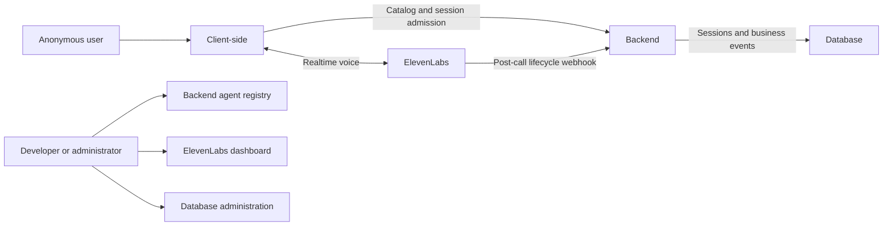
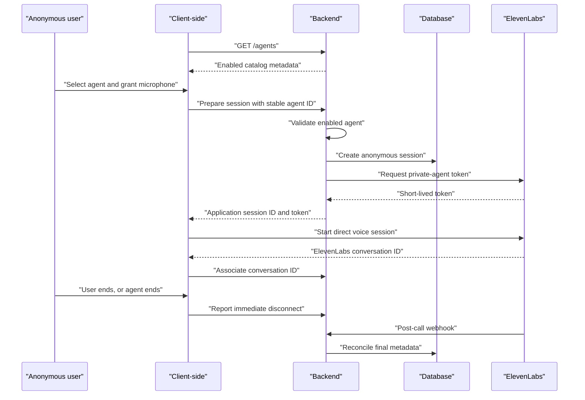

# Voice Agent Platform Design

- Status: Approved design
- Date: 2026-08-12
- Scope: Version 1

## Purpose

Build a browser-based platform where an anonymous user selects a specialized
agent and completes a task through a voice-first conversation. The release uses
two substantially different agents to ensure the platform is not overfit to one
workflow:

1. Drive-through ordering
2. House-painting service

The detailed behavior, knowledge, tools, and outcome schemas of those agents
will be designed separately. This design establishes the shared platform they
run on.

## Product experience

Client-side shows a catalog of enabled agents retrieved from Backend. The user
selects an agent, grants microphone permission, and begins speaking without an
account or intake form.

During the session, Client-side displays connection state, listening or
speaking state, mute control, and an end-session control. The user may end at
any time. The agent may end after deciding the conversation is complete. After
disconnection, Client-side displays only that the session ended.

There is no user-facing transcript, outcome summary, custom post-call message,
or custom administrator application.

## Agent model

Agents are independent flat catalog entries. There is no agent-type hierarchy,
inheritance model, generic agent builder, or shared domain workflow.

Each agent may later define its own prompt, knowledge, tools, business events,
structured results, and completion rules. Tools may retrieve information or
perform actions in another service, and their results may change the direction
of the conversation. The exact tool execution architecture remains part of each
agent's focused design.

## System architecture



### Client-side

- Retrieves enabled public agent metadata through `GET /agents`.
- Requests microphone permission.
- Requests session admission from Backend.
- Starts a direct ElevenLabs voice connection with a short-lived token.
- Owns call controls and immediate user-visible state.
- Reports the ElevenLabs conversation ID and immediate disconnect state to
  Backend.

### Backend

- Owns a code-defined, flat agent registry.
- Maps stable public agent IDs to private ElevenLabs agent IDs.
- Enforces each agent's enabled switch before issuing a session token.
- Creates anonymous application sessions.
- Requests short-lived private-agent tokens from ElevenLabs.
- Receives lifecycle callbacks and post-call webhooks.
- Stores application metadata and future business events in Database.
- Never proxies realtime voice media.

### Database

- Stores anonymous application sessions, selected agent IDs, ElevenLabs
  conversation IDs, lifecycle timestamps, statuses, and business events.
- Does not store audio or transcripts.

### ElevenLabs

- Owns realtime transport, speech recognition, model orchestration, speech
  synthesis, turn-taking, interruptions, and provider conversation history.
- Is the transcript inspection surface.
- Runs private agents so every new session must be admitted through Backend.

## Session lifecycle



`POST /sessions` is the conceptual admission boundary. Its exact name and
payload may follow the final ElevenLabs client integration, but Backend must
retain the responsibilities shown above.

Disabling an agent removes it from the catalog and blocks new sessions. It does
not terminate a session already in progress.

## Data ownership

ElevenLabs owns provider conversation history, transcripts, analysis, and any
audio retained under its configured policies. Backend may receive transcript
content inside a post-call webhook but does not persist that content.

The application owns stable agent identity, anonymous sessions, provider
correlation IDs, lifecycle metadata, structured outcomes, and business events.

## Technology mapping

Logical architecture names remain separate from technology choices:

| Logical component | Implementation |
| --- | --- |
| Client-side | React, Vite, shadcn/ui with the supplied preset, Tailwind CSS, TanStack Query, Redux Toolkit, pnpm |
| Backend | Python, FastAPI, Pydantic, Cloudflare Python Workers, uv, pywrangler |
| Database | Supabase-hosted PostgreSQL, HTTPS Data API, SQL migrations, Supabase CLI |
| ElevenLabs | ElevenLabs Agents and its React client integration |

TanStack Query owns server state in Client-side. Redux Toolkit is reserved for
shared client state that is not fetched server data.

Backend uses the Supabase HTTPS Data API rather than SQLModel or a direct
PostgreSQL driver. Its privileged Supabase key and ElevenLabs API key exist only
as Backend secrets.

## Repository and deployment

```text
apps/
  client/
  backend/
supabase/
  config.toml
  migrations/
  seed.sql
docs/
```

- Client-side deploys independently to Cloudflare Workers Static Assets.
- Backend deploys independently to Cloudflare Python Workers.
- Database migrations are committed SQL files.
- Supabase CLI targets local Supabase during local development.
- After migration changes merge to `main`, a serialized deployment job runs
  `supabase db push` against production.
- Relevant changes merged to `main` automatically deploy the affected area.
- The deployment mechanism may be Cloudflare native Git integration, generated
  workflows, or small custom workflows. Workflow names and files are not part
  of the architecture contract.

Only local development and production exist. There is no staging environment,
custom domain requirement, CI test suite, manual deployment approval,
coordinated Backend/Database deployment order, migration compatibility policy,
or automated migration recovery system.

## Failure behavior

- If microphone permission is denied, no session starts.
- If Backend rejects an unknown or disabled agent, no ElevenLabs token is
  issued.
- If session preparation or ElevenLabs connection fails, Client-side remains
  outside an active call and may allow the user to try again.
- If a connected call disconnects unexpectedly, Client-side shows that the
  session ended.
- Backend uses the post-call webhook to reconcile final metadata when the
  browser cannot report a clean end.

Detailed tool failures and agent responses are defined with each agent because
their business consequences differ.

## Testing boundary

No automated tests run in deployment automation. The platform will be checked
locally during implementation, and real voice behavior will be exercised
manually through ElevenLabs and the deployed application. Automation does not
consume ElevenLabs call credits.

## Out of scope

- User accounts
- Telephone calls
- Email, WhatsApp, CRM, payments, POS, or fulfillment systems
- Custom admin interfaces
- User-facing transcripts or post-call summaries
- Application-owned transcript or audio storage
- Shared agent-type abstractions
- Staging infrastructure and production-scale operations
- Concrete agent prompts, knowledge bases, tools, schemas, and evaluations

## Related documents

- [Product Requirements](../../requirements/product-requirements.md)
- [Platform Architecture and Session Lifecycle](../../architecture/platform-foundation.md)
- [Deployment and Operations](../../architecture/deployment-and-operations.md)
- [Technology Stack](../../technology/stack.md)
- [ADR 0001: Use ElevenLabs](../../decisions/0001-use-elevenlabs-managed-voice-runtime.md)
- [ADR 0002: Gate private sessions through Backend](../../decisions/0002-gate-private-elevenlabs-sessions-through-backend.md)
